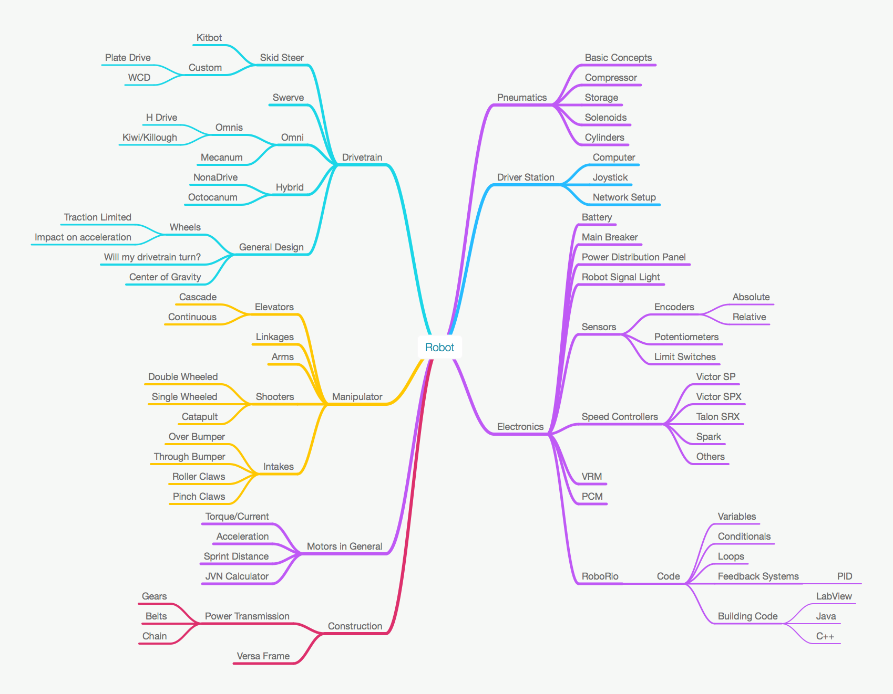

# FRC Assistant

This is an attempt to help share that institutional knowledge that most veteran FRC teams have with other teams. It's set up as an interactive fiction for folks to walk through to help guide them to what resources will help them. 

### Current Content Plan 


## Contributing 

Content is written in [Ink](https://github.com/inkle/ink/blob/master/Documentation/WritingWithInk.md) I've tried to break major subsystems into unique files linked into the main ink file. I've done most of the writing in [Inky](https://github.com/inkle/inky). To publish overwrite the FRC Assistant.js file using the _Export to JSON..._ option. 


## Adding a resource

Adding a resource is a two part process, first you must reference it in Ink using a tag in format of `# { "resource": "path.to.resource"}` then you add that resource to the `resources.json` file. This was done so updating new links to things requires a redeploy but not a regeneration of the Ink text. Also, and more honestly, because embedding links inside the Ink text required extensive escaping and was a general pain. This is easier, trust me. 

Resources consist, minimally of the following structure: 

```
"key": {
            "type": "resource",
            "link": "URI for accessing the resource",
            "thumbnail": "URI for accessing the displayed thumbnail, currently does not default to anything",
            "source": "Text for where you got this from, think of it as attribution"
        }
```

For now all resources should be of type 'resource'. The main reason for this in the structure is to enable more rich handling of resource types down the road should a need for that occur. 

The path in the Ink file must match to the path in the `resources.json` or it won't be looked up properly and will be stripped out.